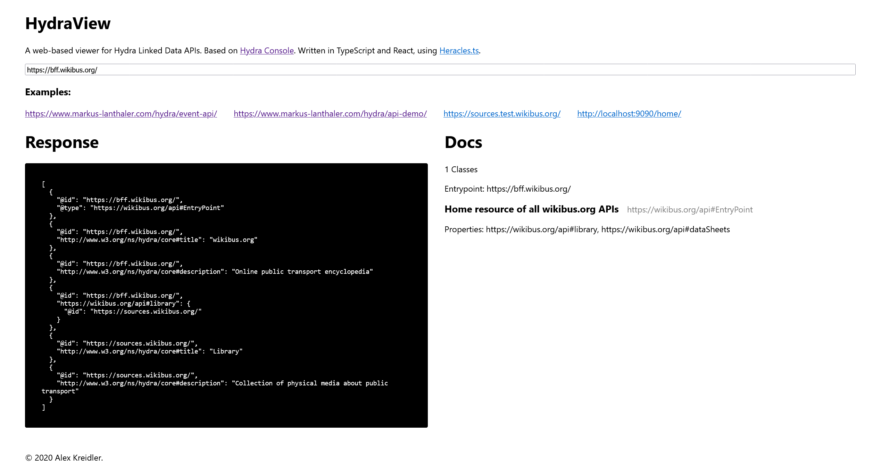

# [HydraView](https://hydraview.alexkreidler.com/)

A web-based viewer for Hydra Linked Data APIs, based on [Hydra Console](https://www.markus-lanthaler.com/hydra/console/?url=http://www.markus-lanthaler.com/hydra/event-api/). Written in TypeScript and React, using [Heracles.ts](https://github.com/HydraCG/Heracles.ts).

Right now, the project is very simple, so it is a good example of how to use the Hercules.ts client for Hydra. Feel free to read the source code.

**Note: this project is still in development.** Only the basics are implemented, and features may be missing. It does not approach the features of Hydra Console yet.